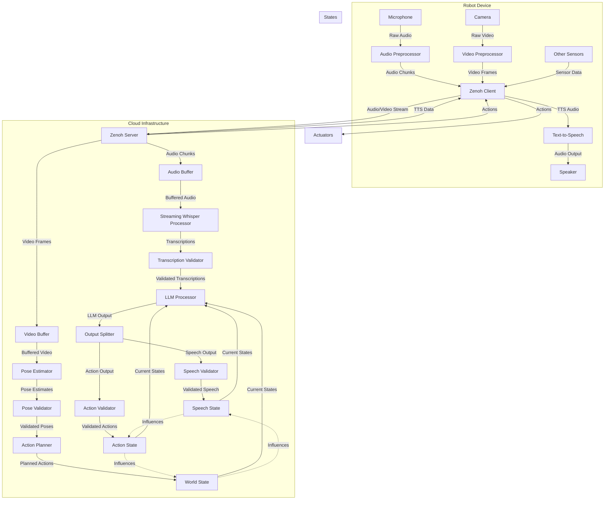

# Architecture

## Overview

The Mbodi architecture is a hybrid system that combines symbolic planning with learned policies. It is designed to be robust and reliable in everyday environments.

## Components

